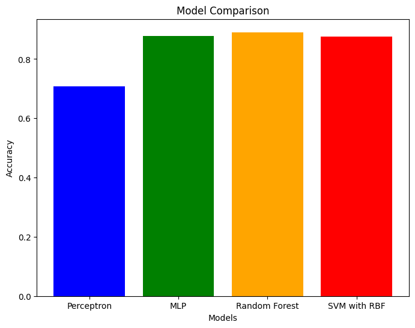
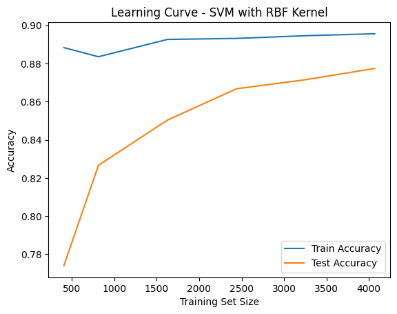
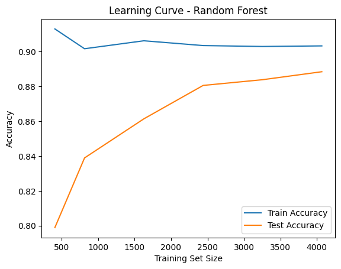
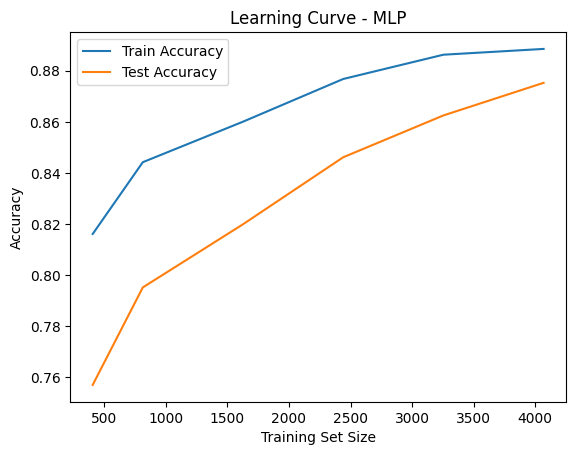
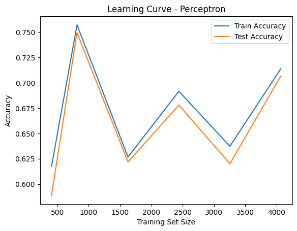

# 🩺 Stroke Prediction – Machine Learning Model Comparison

This project compares multiple machine learning models for predicting the likelihood of stroke occurrence using medical and demographic features.  
The goal is to evaluate the performance of different algorithms and identify the most accurate one for this classification task.
🔗 [View Notebook on Kaggle]([https://www.kaggle.com/code/parveenkaur17/stroke-prediction-ml-model-comparison](https://www.kaggle.com/code/parveenkaur17/stroke-prediction-ml-model-comparison))

---

## 📊 Dataset
The dataset contains medical and demographic attributes such as:
- Age  
- Gender  
- Hypertension  
- Heart disease history  
- Average glucose level  
- BMI  
- Smoking status  

**Dataset Source:** [Healthcare Stroke Prediction Dataset – Kaggle](https://www.kaggle.com/datasets/parveenkaur17/healthcare-stroke-prediction-dataset)

---

## 🤖 Models Used
The following models were implemented and compared:
- **SVM (Support Vector Machine)**
- **Random Forest (RF)**
- **Multi-Layer Perceptron (MLP)**
- **Perceptron**

---

## 📈 Results

### Model Comparison


### Learning Curves
- **SVM**  
  

- **Random Forest**  
  

- **Multi-Layer Perceptron (MLP)**  
  

- **Perceptron**  
  

---

## 🚀 How to Run
1. Clone the repository:  
   ```bash
   git clone https://github.com/kaurparveen1719-creator/stroke-prediction-ml-model-comparison.git
   cd stroke-prediction-ml-model-comparison
